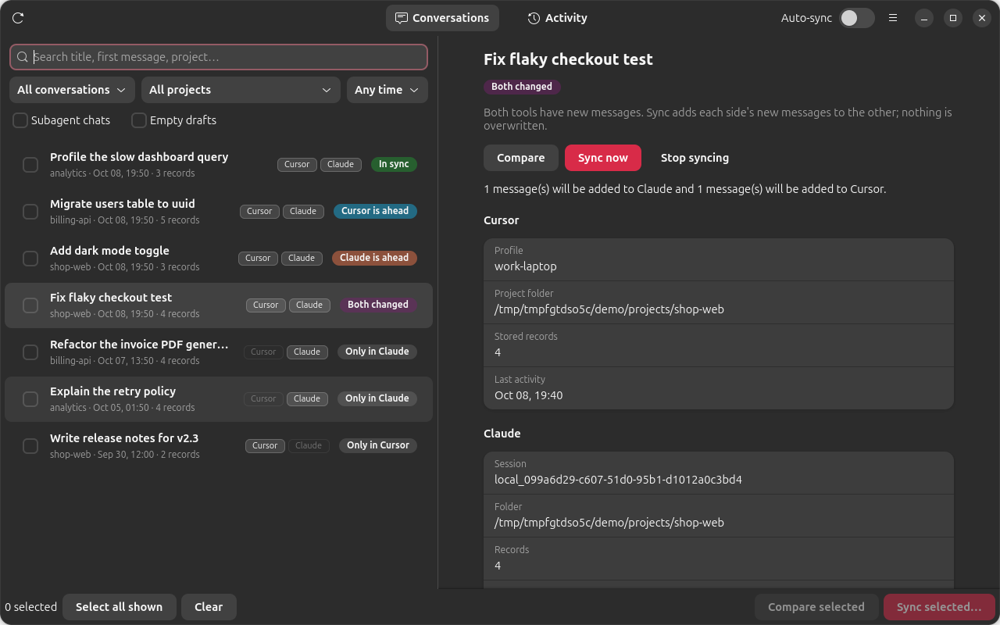
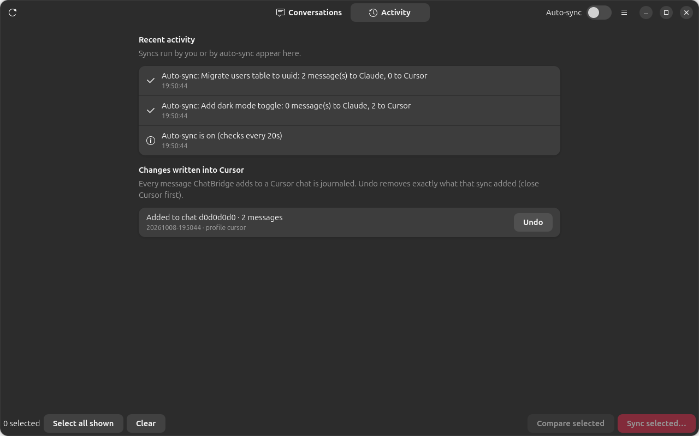

# ChatBridge

[](https://github.com/pwnapplehat/chatbridge/actions/workflows/ci.yml)
[](LICENSE)

**Two-way chat history sync between Cursor and Claude.** Continue a conversation in either tool and carry it over to the other, with every message, the model's reasoning and all tool calls (with their outputs). Linux (Ubuntu) today; Windows and macOS are planned.



## Why

Cursor and Claude each keep their chat history in their own format. If you start a task in Cursor and want to finish it in Claude (or the other way round), you lose the context. ChatBridge reads both stores, pairs the conversations that belong together, and appends what each side is missing to the other, so you can keep working wherever you are.

## Features

- **Import and sync in both directions**: Cursor → Claude and Claude → Cursor, including conversations you continued in both tools.
- **Lossless**: your messages verbatim, assistant replies, reasoning, and tool calls with their outputs and errors.
- **Knows what is already imported**: pairs are detected automatically (a link store plus deterministic ids), so nothing is imported twice.
- **Time-ordered, append-only merge**: continue in Claude until 6 pm, then in Cursor, then sync; each tool receives the other's newer messages. If you continued in both, both are merged without losing or duplicating anything. Existing history is never rewritten or deleted.
- **Auto-sync** (optional): keeps linked conversations up to date in the background, from the app or as a systemd user service.
- **Safe by design**: dry run / Compare before every change, confirmation before writes, one-click Undo for everything written into Cursor, and Cursor is never written while it is running.
- **Multiple Cursor accounts and backups**: every Cursor profile (including `~/.cursor-accounts/*` and old backups) is supported; backups are read-only sources.
- **Professional GTK4 / libadwaita app** plus a scriptable CLI that uses the same engine.



## Install (Ubuntu / Debian-based)

**Ubuntu 24.04+ / Debian 13+ (recommended): the `.deb`**

```bash
git clone https://github.com/pwnapplehat/chatbridge.git && cd chatbridge
packaging/deb/build-deb.sh                      # -> dist/chatbridge_1.0.2_all.deb (no root needed)
sudo apt install ./dist/chatbridge_1.0.2_all.deb    # apt pulls in GTK4/libadwaita/python3-gi
systemctl --user enable --now chatbridge-sync   # optional: background auto-sync
```

Other distributions or no root: `./install.sh` (user-level; tells you which GTK4/libadwaita packages to add for Fedora, Arch, openSUSE), `./install.sh --service`, `./install.sh --uninstall`. Details and the support matrix: [docs/PACKAGING.md](docs/PACKAGING.md).

Please follow the [manual test plan](docs/TESTING.md) for the parts only a real Cursor and Claude can verify.

Without installing: `python3 -m venv .venv --system-site-packages && .venv/bin/pip install -e . && .venv/bin/python -m chatbridge.gui`.

Requirements: Python 3.11+ (developed and tested on 3.14; the code is syntax-checked for 3.11 and CI runs the distribution's Python), GTK 4 and libadwaita (GUI only; the CLI needs neither), Cursor and/or the Claude desktop app / Claude Code.

## Quick start

1. Run `chatbridge doctor` to see what ChatBridge found (Cursor profiles, Claude folders, whether Cursor is running).
2. Open **ChatBridge**. The list shows every conversation from both tools with its state:

| State | Meaning | Action |
|---|---|---|
| **In sync** | both tools have the same messages | none |
| **Cursor is ahead** / **Claude is ahead** | one tool has newer messages | *Sync now* appends them to the other |
| **Both changed** | both were continued | *Sync now* merges both ways, nothing overwritten |
| **Only in Cursor** / **Only in Claude** | exists in one tool | *Import into Claude* / *Send to Cursor* |
| **Not compared yet** | same conversation found, never compared | *Compare* |

3. Select a conversation → **Compare** shows exactly what would be added to each side; **Sync now** asks for confirmation and does it.
4. Nothing is selected or imported automatically. Turn on **Auto-sync** to keep already-linked conversations current.
5. After syncing into Claude, reopen the session (or restart the app). After syncing into Cursor, just open Cursor.

### Command line

```bash
chatbridge list                                  # unified list with states
chatbridge sync --chat 22694eae                  # dry run for one Cursor chat (id prefix)
chatbridge sync --chat 22694eae --apply          # import / sync it
chatbridge sync --claude local_ab12 --apply      # a Claude session -> Cursor
chatbridge sync --linked --apply                 # every paired conversation
chatbridge sync --all --apply                    # EVERYTHING in both tools (must be explicit)
chatbridge sync --linked --direction to-claude --apply
chatbridge watch --interval 20                   # auto-sync loop (Ctrl+C to stop; --once for one pass)
chatbridge cursor-undo --journal <file>          # revert one write made into Cursor
chatbridge doctor
```

Everything is a dry run unless `--apply` is given, and nothing is selected implicitly.

## How the sync works

Both tools are read into the same tool-neutral event stream (human text, assistant text, reasoning, tool calls). Each event has a content identity. Syncing a pair appends the events one side lacks to the other, as a multiset difference:

- **Idempotent**: a second sync finds nothing to do.
- **No stored baseline needed**: if the link database is lost, pairs are re-detected from deterministic ids and a sync simply fills any gaps.
- **Never destructive**: nothing is rewritten or removed on either side; deletions do not propagate.
- **Order**: when only one side changed, its new messages arrive in order. When both changed, each side receives the other's new messages appended after its own, with the original timestamps recorded in Cursor.

Details and edge cases: [docs/SYNC.md](docs/SYNC.md). Storage formats: [docs/FORMATS.md](docs/FORMATS.md). Design: [docs/ARCHITECTURE.md](docs/ARCHITECTURE.md).

## What is preserved

| Source | Becomes |
|---|---|
| Your messages | verbatim user messages (harness text such as `<system-reminder>` blocks is not conversation and is skipped) |
| Assistant replies | assistant messages |
| Tool calls, outputs, errors | real `tool_use` / `tool_result` pairs in Claude; MCP-style tool calls (server "claude") in Cursor |
| Reasoning | text marked `[Cursor reasoning]` in Claude (Cursor reasoning has no signature, so it cannot be a native thinking block); native reasoning in Cursor |
| Images | a note that images were attached (image bytes are not copied) |
| Subagent runs | separate conversations (hidden by default); their missing first message is replaced by a labelled placeholder |

## Safety model

- Cursor databases are opened read-only for reading. Writes go through a single SQLite transaction per chat, **only while Cursor is not running on that profile**, and a journal of every touched row is saved first (Activity → Undo).
- Claude logs are only ever appended to (never rewritten), with a settle check so a turn in progress is not disturbed.
- Every written Claude log is re-read and compared with its source (counts and character totals) and structurally validated; a failure quarantines the file as `*.unverified` instead of exposing it.
- Back up anything irreplaceable before the first big sync. ChatBridge does not delete your data, but it is software that writes into other applications' stores.

## Status and verification

What is covered by automated tests (`./scripts/check.sh`: ruff, `mypy --strict`, unit, CLI end-to-end and GUI end-to-end tests under a virtual display, all on synthetic data):

- both directions, follow-ups in each tool, both-changed merges, repeated identical messages, session re-keying by the Claude app, deferral while Cursor is running, Undo, transcript-only chats, Claude Code CLI-only setups;
- a randomized round-trip property test (events survive Cursor and Claude unchanged).

Verified against real data on the author's machine (Cursor 3.23.12, Claude desktop app 2.1.x): all 257 non-empty Cursor chats converted into Claude with zero mismatches, and four real chats (including one with about 192,000 records) round-tripped Cursor → Claude → Cursor with identical message sets. Imported sessions were opened and continued in the Claude desktop app.

**Cursor-side writes** mirror records captured from a real Cursor 3.23.12 chat and are verified by structure and by round trip, but the first time you send a Claude conversation to Cursor, check that one chat opens as expected in your Cursor before syncing many. Cursor changes its internal format between versions; `scripts/gen_cursor_templates.py` regenerates the templates, and Undo reverts any write.

## Limitations

- Cursor must be closed on the target profile for Claude → Cursor writes (they are deferred, not lost, while it is open).
- Cursor transcript files (`~/.cursor/projects/*/agent-transcripts`) are read-only sources: they sync Cursor → Claude only and contain no tool outputs.
- Cursor's internal agent state used to continue a model turn server-side is not recreated; the visible conversation is. If a continued turn in Cursor lacks context, say "continue from the conversation above".
- Linux only for now.

## Roadmap

Windows and macOS support (path discovery and process detection are isolated in `config.py` and `cursor_writer.py`), signed packages, and import of more tools.

## Development

```bash
python3 -m venv .venv --system-site-packages && .venv/bin/pip install -e . mypy pytest ruff
./scripts/check.sh                       # everything CI runs
python scripts/make_demo.py /tmp/demo    # synthetic Cursor + Claude data for trying the app safely
```

See [CONTRIBUTING.md](CONTRIBUTING.md). Report security issues as described in [SECURITY.md](SECURITY.md).

## License

MIT. See [LICENSE](LICENSE).
